# WorkFX AI Helm Chart

[](https://github.com/workfx/workfx-ai-helm/releases)
[](https://kubernetes.io/)
[](https://helm.sh/)

Deploy [WorkFX AI Platform](https://workfx.ai), an enterprise-grade AI platform on Kubernetes with Helm chart.

## 🚀 Quick Start

### 1. Add Helm Repository

```bash
helm repo add workfx-ai https://workfx.github.io/workfx-ai-helm
helm repo update
```

### 2. Install WorkFX AI Platform

#### Development Environment (Recommended for testing)

```bash
helm install workfx-ai workfx-ai/workfx-ai \
  --namespace workfx-ai \
  --create-namespace \
  -f values-dev.yaml
```

#### Production Environment

```bash
helm install workfx-ai workfx-ai/workfx-ai \
  --namespace workfx-ai \
  --create-namespace \
  -f values-prod.yaml
```

### 3. Verify Installation

```bash
kubectl get pods -n workfx-ai
kubectl get services -n workfx-ai
```

## 🏗️ Architecture

The following diagram illustrates the complete network architecture and service topology:

```mermaid
graph TB
    %% External Traffic Entry Points
    Internet[🌐 Internet] --> Ingress[🚪 Ingress Controller]
    Internet --> LB[⚖️ LoadBalancer Service]

    %% Main Traffic Flow
    Ingress --> APIService[🔧 API Service<br/>Port: 8000]
    LB --> APIService

    %% Core Services
    APIService --> APIPod[📦 API Pod<br/>workfx/workfx-ai-api<br/>Port: 8000]
    CDCService[🔄 CDC Service<br/>Port: 8001] --> CDCPod[📦 CDC Pod<br/>workfx/workfx-ai-cdc<br/>Port: 8001]

    %% Infrastructure Layer
    subgraph InfrastructureLayer [🏗️ Infrastructure Layer]
        PostgresService[🐘 PostgreSQL Service<br/>Port: 5432]
        RedisService[🔴 Redis Service<br/>Port: 6379]
        KafkaService[📨 Kafka Service<br/>Port: 9092]
        ElasticsearchService[🔍 Elasticsearch Service<br/>Port: 9200]
        KibanaService[📊 Kibana Service<br/>Port: 80]
        AKHQService[🎛️ AKHQ Service<br/>Port: 80]
    end

    %% Service Connections
    APIPod -.->|Database Operations| PostgresService
    CDCPod -.->|Database Operations| PostgresService
    APIPod -.->|Cache & Sessions| RedisService
    CDCPod -.->|Message Processing| KafkaService
    APIPod -.->|Search & Logs| ElasticsearchService

    %% Storage Layer
    subgraph StorageLayer [💾 Storage Layer]
        StorageType{Storage Type}
        LocalPVC[📁 Local PVC]
        AzureStorage[☁️ Azure Blob]
        S3Storage[☁️ AWS S3]
        GCSStorage[☁️ Google Cloud Storage]
    end

    %% External Services
    subgraph ExternalServices [🌐 External Services]
        ExternalDB[(🔧 External PostgreSQL)]
        ExternalRedis[(🔴 External Redis)]
        ExternalKafka[(📨 External Kafka)]
        ExternalES[(🔍 External Elasticsearch)]
    end

    %% Styling
    classDef podClass fill:#e1f5fe,stroke:#0277bd,stroke-width:2px
    classDef serviceClass fill:#f3e5f5,stroke:#7b1fa2,stroke-width:2px
    classDef storageClass fill:#e8f5e8,stroke:#2e7d32,stroke-width:2px
    classDef externalClass fill:#fff3e0,stroke:#ef6c00,stroke-width:2px

    class APIPod,CDCPod podClass
    class APIService,CDCService,PostgresService,RedisService,KafkaService,ElasticsearchService,KibanaService,AKHQService serviceClass
    class PostgresService,RedisService,KafkaService,ElasticsearchService,LocalPVC,AzureStorage,S3Storage,GCSStorage storageClass
    class ExternalDB,ExternalRedis,ExternalKafka,ExternalES externalClass
```



## 🎯 Core Components

| Component | Image | Port | Role |
|-----------|-------|------|------|
| **API** | `workfx/workfx-ai-api` | 8000 | RESTful API server, business logic processing |
| **CDC** | `workfx/workfx-ai-cdc` | 8001 | Change Data Capture service, data synchronization |
| **PostgreSQL** | `bitnami/postgresql:15` | 5432 | Primary database with vector search support |
| **Redis** | `bitnami/redis:7` | 6379 | Cache and session storage |
| **Kafka** | `bitnami/kafka:3` | 9092 | Message queue and stream processing |
| **Elasticsearch** | `bitnami/elasticsearch:8` | 9200 | Search engine and log aggregation |
| **Kibana** | `bitnami/kibana:8` | 80 | Elasticsearch management interface |
| **AKHQ** | `tchiotludo/akhq:latest` | 80 | Kafka management interface |

## 🌟 Key Features

### 🚀 **Flexible Deployment Modes**
- **Complete Mode**: Deploy all infrastructure services
- **Hybrid Mode**: Mix of Helm-managed and external services
- **Minimal Mode**: Only deploy application services (perfect for KA users)

### ☁️ **Multi-Cloud Support**
- **Azure**: Complete Azure service integration
- **AWS**: Full AWS service support
- **GCP**: Google Cloud Platform support
- **Local**: On-premises Kubernetes deployment

### 🔧 **Smart Configuration Management**
- **Unified ConfigMap**: All services share single configuration
- **External Secret Integration**: Support for cloud key management
- **Environment-Specific**: Pre-configured dev/prod environments
- **Conditional Rendering**: Intelligent service deployment

### 📊 **Enterprise-Grade Monitoring**
- **Elasticsearch + Kibana**: Log aggregation and search
- **AKHQ**: Kafka cluster management
- **Health Checks**: Built-in health monitoring
- **Metrics Collection**: Performance and resource monitoring

### 🔐 **Security First**
- **RBAC**: Role-based access control
- **Network Policies**: Pod-level network isolation
- **Pod Security Standards**: Kubernetes security best practices
- **TLS Encryption**: Secure communication

## 📋 Prerequisites

- **Kubernetes**: 1.19+
- **Helm**: 3.0+
- **kubectl**: Configured and accessible
- **Storage Class**: Configured (if using persistent volumes)
- **Resources**: Minimum 8GB RAM, 4 CPU cores

## 🚀 Deployment Modes

### 1. **Complete Deployment** (All-in-One)

Deploy everything with Helm:

```yaml
infrastructure:
  postgresql: enabled: true
  redis: enabled: true
  kafka: enabled: true
  elasticsearch: enabled: true
  akhq: enabled: true
```

**Best for**: Development, testing, environments without existing infrastructure

### 2. **Hybrid Deployment** (Mixed)

Use external database/cache, deploy other services:

```yaml
infrastructure:
  postgresql: enabled: false, external: enabled: true
  redis: enabled: false, external: enabled: true
  kafka: enabled: true
  elasticsearch: enabled: true
```

**Best for**: Environments with existing database/cache, mixed cloud setups

### 3. **Minimal Deployment** (KA Users)

Deploy only application services:

```yaml
infrastructure:
  postgresql: enabled: false, external: enabled: true
  redis: enabled: false, external: enabled: true
  kafka: enabled: false, external: enabled: true
  elasticsearch: enabled: false, external: enabled: true
```

**Best for**: Key Account users, production environments with complete infrastructure

## 🔧 Configuration

### Environment-Specific Configs

- **`values-dev.yaml`**: Development environment with reduced resources
- **`values-prod.yaml`**: Production environment with high availability
- **Custom values**: Override specific configurations as needed

### External Service Integration

```yaml
infrastructure:
  postgresql:
    enabled: false
    external:
      enabled: true
      host: "your-postgres-host"
      port: 5432
      username: "your-username"
      password: "your-password"
      database: "your-database"
```

### Cloud Provider Configuration

```yaml
global:
  cloudProvider: "azure"  # azure, aws, gcp, local
  azure:
    keyVaultUrl: "https://your-keyvault.vault.azure.net/"
    clientId: "your-client-id"
    clientSecret: "your-client-secret"
    tenantId: "your-tenant-id"
```

## 📚 Documentation

- **[Architecture Guide](docs/ARCHITECTURE.md)**: Detailed system architecture and design principles
- **[KA Deployment Guide](docs/KA_DEPLOYMENT_GUIDE.md)**: Specialized guide for Key Account users
- **[Contents Overview](docs/CONTENTS.md)**: Complete feature and component reference
- **[Deployment Guide](DEPLOYMENT_GUIDE.md)**: Comprehensive deployment instructions

## 🔍 Monitoring & Access

### Access Kibana

```bash
kubectl port-forward -n workfx-ai svc/workfx-ai-elasticsearch-kibana 8080:80
# Visit http://localhost:8080
```

### Access AKHQ (Kafka Management)

```bash
kubectl port-forward -n workfx-ai svc/workfx-ai-akhq 8081:80
# Visit http://localhost:8081
```

### Application Logs

```bash
# API Service logs
kubectl logs -n workfx-ai deployment/workfx-ai-api -f

# CDC Service logs
kubectl logs -n workfx-ai deployment/workfx-ai-cdc -f
```

## 🚨 Troubleshooting

### Common Issues

1. **Pod Startup Failures**
   - Check resource limits and requests
   - Verify image registry access
   - Validate ConfigMap and Secret configuration

2. **Service Connection Failures**
   - Verify service names and ports
   - Check network policy configuration
   - Validate external service connectivity

3. **Storage Issues**
   - Check StorageClass configuration
   - Verify PVC binding status
   - Check storage quotas

### Debug Commands

```bash
# Check Pod status
kubectl get pods -n workfx-ai

# View Pod logs
kubectl logs -n workfx-ai deployment/workfx-ai-api

# Check ConfigMap
kubectl get configmap -n workfx-ai workfx-ai-config -o yaml

# Check Secrets
kubectl get secret -n workfx-ai workfx-ai-secret -o yaml

# Debug Pod
kubectl exec -it -n workfx-ai deployment/workfx-ai-api -- /bin/bash
```

## 🔄 Upgrade & Maintenance

### Upgrade Helm Chart

```bash
helm repo update
helm upgrade workfx-ai workfx-ai/workfx-ai \
  --namespace workfx-ai \
  -f values-prod.yaml
```

### Upgrade Application Version

```bash
helm upgrade workfx-ai workfx-ai/workfx-ai \
  --namespace workfx-ai \
  --set workfx.api.image.tag="new-version" \
  --set workfx.cdc.image.tag="new-version"
```

### Rollback

```bash
helm history workfx-ai -n workfx-ai
helm rollback workfx-ai <revision> -n workfx-ai
```

## 🗑️ Uninstall

```bash
helm uninstall workfx-ai -n workfx-ai
kubectl delete namespace workfx-ai
```

## 🤝 Contributing

We welcome contributions! Please see our [Contributing Guide](CONTRIBUTING.md) for details.

## 📄 License

This project is proprietary software. See [LICENSE](LICENSE) for details.

## 🆘 Support

For support and questions:

- **Email**: support@workfx.ai
- **Website**: https://workfx.ai
- **GitHub Issues**: [workfx/workfx-ai-helm](https://github.com/workfx/workfx-ai-helm/issues)
- **Documentation**: [docs/](docs/) directory

## 🏆 Why Choose WorkFX AI Helm Chart?

- **🚀 Production Ready**: Built with enterprise-grade reliability and security
- **🔧 Flexible**: Support for multiple deployment modes and cloud providers
- **📊 Observable**: Comprehensive monitoring and logging out of the box
- **🔄 Scalable**: Horizontal and vertical scaling capabilities
- **🔐 Secure**: Security-first design with RBAC and network policies
- **📚 Well Documented**: Extensive documentation and examples
- **🤝 Community Driven**: Active development and community support

---

**Ready to deploy?** Start with our [Quick Start](#-quick-start) guide or dive deep into our [documentation](docs/)!
