# WorkFX AI Helm Chart 架构介绍

## 概述

WorkFX AI Helm Chart 是一个用于在 Kubernetes 上部署 WorkFX AI 平台的完整解决方案。该 Chart 采用模块化设计，支持多种部署模式，满足不同用户的需求。

## 架构设计原则

### 1. 模块化架构
- **核心服务**: WorkFX AI API 和 CDC 服务
- **基础设施服务**: 数据库、缓存、消息队列、搜索引擎等
- **监控服务**: 日志收集、指标监控、管理界面
- **可选服务**: 根据需求选择性部署

### 2. 灵活部署模式
- **完整部署**: 所有服务都由 Helm 管理
- **混合部署**: 部分服务使用 Helm，部分使用外部服务
- **最小部署**: 只部署应用服务，所有基础设施使用外部服务

### 3. 多云支持
- **Azure**: 完整的 Azure 服务集成
- **AWS**: 支持 AWS 服务和 S3 存储
- **GCP**: 支持 Google Cloud 服务
- **本地部署**: 支持本地 Kubernetes 集群

## 系统架构图

```mermaid
graph TB
    %% 外部流量入口
    Internet[🌐 Internet] --> Ingress[🚪 Ingress Controller]
    Internet --> LB[⚖️ LoadBalancer Service]

    %% 主要流量流
    Ingress --> APIService[🔧 API Service<br/>Port: 8000]
    LB --> APIService

    %% 核心服务
    APIService --> APIPod[📦 API Pod<br/>workfx/workfx-ai-api<br/>Port: 8000]
    CDCService[🔄 CDC Service<br/>Port: 8001] --> CDCPod[📦 CDC Pod<br/>workfx/workfx-ai-cdc<br/>Port: 8001]

    %% 基础设施层
    subgraph InfrastructureLayer [🏗️ Infrastructure Layer]
        PostgresService[🐘 PostgreSQL Service<br/>Port: 5432]
        RedisService[🔴 Redis Service<br/>Port: 6379]
        KafkaService[📨 Kafka Service<br/>Port: 9092]
        ElasticsearchService[🔍 Elasticsearch Service<br/>Port: 9200]
        KibanaService[📊 Kibana Service<br/>Port: 80]
        AKHQService[🎛️ AKHQ Service<br/>Port: 80]
    end

    %% 服务连接
    APIPod -.->|Database Operations| PostgresService
    CDCPod -.->|Database Operations| PostgresService
    APIPod -.->|Cache & Sessions| RedisService
    CDCPod -.->|Message Processing| KafkaService
    APIPod -.->|Search & Logs| ElasticsearchService

    %% 存储层
    subgraph StorageLayer [💾 Storage Layer]
        StorageType{Storage Type}
        LocalPVC[📁 Local PVC]
        AzureStorage[☁️ Azure Blob]
        S3Storage[☁️ AWS S3]
        GCSStorage[☁️ Google Cloud Storage]
    end

    %% 存储连接
    APIPod -.->|File Storage| StorageType
    CDCPod -.->|File Storage| StorageType

    StorageType --> LocalPVC
    StorageType --> AzureStorage
    StorageType --> S3Storage
    StorageType --> GCSStorage

    %% 外部服务选项
    subgraph ExternalServices [🌐 External Services]
        ExternalDB[(🔧 External PostgreSQL)]
        ExternalRedis[(🔴 External Redis)]
        ExternalKafka[(📨 External Kafka)]
        ExternalES[(🔍 External Elasticsearch)]
    end

    %% 外部服务连接（替代方案）
    APIPod -.->|Alternative| ExternalDB
    APIPod -.->|Alternative| ExternalRedis
    APIPod -.->|Alternative| ExternalKafka
    APIPod -.->|Alternative| ExternalES

    %% 样式定义
    classDef podClass fill:#e1f5fe,stroke:#0277bd,stroke-width:2px
    classDef serviceClass fill:#f3e5f5,stroke:#7b1fa2,stroke-width:2px
    classDef storageClass fill:#e8f5e8,stroke:#2e7d32,stroke-width:2px
    classDef externalClass fill:#fff3e0,stroke:#ef6c00,stroke-width:2px

    class APIPod,CDCPod podClass
    class APIService,CDCService,PostgresService,RedisService,KafkaService,ElasticsearchService,KibanaService,AKHQService serviceClass
    class PostgresService,RedisService,KafkaService,ElasticsearchService,LocalPVC,AzureStorage,S3Storage,GCSStorage storageClass
    class ExternalDB,ExternalRedis,ExternalKafka,ExternalES externalClass
```

## 核心组件

### 应用服务

| 组件 | 镜像 | 端口 | 角色 |
|------|------|------|------|
| **API** | `workfx/workfx-ai-api` | 8000 | RESTful API 服务器，业务逻辑处理 |
| **CDC** | `workfx/workfx-ai-cdc` | 8001 | 变更数据捕获服务，数据同步 |

### 基础设施服务

| 服务 | 端口 | 角色 | 可选性 |
|------|------|------|--------|
| **PostgreSQL** | 5432 | 主数据库 | ✅ 可外部化 |
| **Redis** | 6379 | 缓存和会话存储 | ✅ 可外部化 |
| **Kafka** | 9092 | 消息队列和流处理 | ✅ 可外部化 |
| **Elasticsearch** | 9200 | 搜索引擎和日志存储 | ✅ 可外部化 |
| **Kibana** | 80 | Elasticsearch 管理界面 | ✅ 可外部化 |
| **AKHQ** | 80 | Kafka 管理界面 | ✅ 可外部化 |

### 存储选项

#### 对象存储
- **Azure Blob Storage**: 完整的 Azure 集成
- **AWS S3**: 支持 S3 兼容存储
- **Google Cloud Storage**: GCS 存储支持
- **本地存储**: PVC 持久化存储

#### 数据库存储
- **PostgreSQL**: 主数据库，支持外部连接
- **Redis**: 缓存数据库，支持外部连接
- **Elasticsearch**: 搜索引擎，支持外部连接

## 网络架构

### 服务发现
- 使用 Kubernetes 内置的服务发现机制
- 服务间通过服务名进行通信
- 支持外部服务的无缝集成

### 流量路由
- **Ingress**: 外部流量入口，支持多种 Ingress 控制器
- **LoadBalancer**: 云服务商的负载均衡器
- **NodePort**: 节点端口访问（开发环境）

### 安全配置
- **网络策略**: 支持 Pod 级别的网络隔离
- **TLS**: 支持 HTTPS 加密
- **认证**: JWT 令牌认证
- **授权**: RBAC 权限控制

## 配置管理

### 配置层次
1. **Chart 默认值**: `values.yaml`
2. **环境特定配置**: `values-dev.yaml`, `values-prod.yaml`
3. **用户自定义**: 命令行参数或外部配置文件
4. **运行时配置**: ConfigMap 和 Secret

### 配置来源
- **环境变量**: 支持从环境变量读取配置
- **云密钥管理**: Azure Key Vault、AWS Secrets Manager、GCP Secret Manager
- **Kubernetes Secret**: 本地密钥管理
- **外部配置**: 配置文件挂载

## 扩展性设计

### 水平扩展
- **API 服务**: 支持多副本部署和自动扩缩容
- **CDC 服务**: 支持多副本部署
- **数据库**: 支持读写分离和集群部署

### 垂直扩展
- **资源限制**: 可配置 CPU 和内存限制
- **存储扩展**: 支持动态存储扩容
- **网络扩展**: 支持网络策略和负载均衡

### 插件化架构
- **基础设施插件**: 支持不同的数据库和存储后端
- **监控插件**: 支持多种监控和日志解决方案
- **安全插件**: 支持不同的认证和授权机制

## 监控和可观测性

### 日志管理
- **结构化日志**: JSON 格式的日志输出
- **日志聚合**: 通过 Elasticsearch 进行日志收集和分析
- **日志查询**: 通过 Kibana 进行日志搜索和可视化

### 指标监控
- **应用指标**: 业务相关的性能指标
- **系统指标**: 资源使用和系统健康状态
- **基础设施指标**: 数据库、缓存等服务的性能指标

### 告警系统
- **健康检查**: 内置的健康检查端点
- **就绪探针**: 确保服务就绪状态
- **存活探针**: 监控服务运行状态

## 部署策略

### 蓝绿部署
- 支持零停机部署
- 快速回滚能力
- 渐进式流量切换

### 金丝雀部署
- 支持渐进式发布
- 流量比例控制
- 实时监控和回滚

### 滚动更新
- 逐个 Pod 更新
- 最小化服务中断
- 自动健康检查

## 总结

WorkFX AI Helm Chart 采用现代化的云原生架构设计，提供了灵活、可扩展、高可用的部署方案。通过模块化设计，用户可以根据自己的需求选择合适的部署模式，无论是开发环境还是生产环境，都能获得最佳的部署体验。
